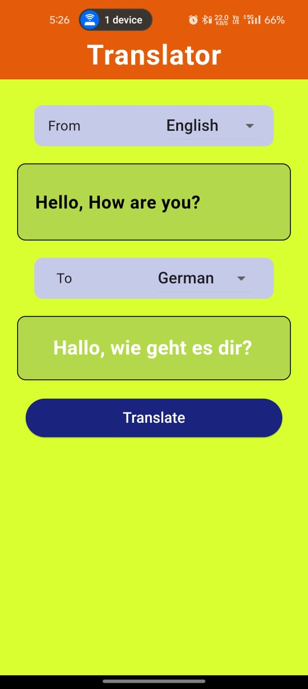

# Translator App



## 📥 Quick Install

**Want to try the app right away?**

Download the latest APK file and install it directly on your Android device:

👉 [Download APK](https://github.com/yourusername/translator_app/releases/latest/download/app-release.apk)

**Installation Steps:**
1. Download the APK file from the link above
2. Enable "Install from Unknown Sources" in your Android settings
3. Open the downloaded APK file
4. Follow the installation prompts
5. Launch the app and start translating!

---

## Overview

A Flutter-based translation application that provides seamless language translation capabilities with a user-friendly interface.

## Features

- 🌍 Multi-language translation support
- 📱 Clean and intuitive user interface
- ⚡ Fast and accurate translations
- 💾 Translation history
- 🎨 Modern Material Design UI

## Prerequisites

Before you begin, ensure you have the following installed:
- Flutter SDK (3.0 or higher)
- Dart SDK
- Android Studio / VS Code
- Android SDK / Xcode (for iOS)

## Installation

1. Clone the repository:
```bash
git clone https://github.com/yourusername/translator_app.git
cd translator_app
```

2. Install dependencies:
```bash
flutter pub get
```

3. Run the app:
```bash
flutter run
```

## Project Structure

```
translator_app/
├── lib/
│   ├── main.dart
│   ├── models/
│   ├── screens/
│   ├── widgets/
│   └── services/
├── assets/
├── android/
├── ios/
└── test/
```

## Technologies Used

- **Flutter** - UI framework
- **Dart** - Programming language
- **Material Design** - Design system

## Building for Production

### Android
```bash
flutter build apk --release
```

### iOS
```bash
flutter build ios --release
```

## Contributing

Contributions are welcome! Please feel free to submit a Pull Request.

## License

This project is licensed under the MIT License - see the LICENSE file for details.

## Contact

For any queries or suggestions, please open an issue in the repository.

## For Developers

If you want to build from source or contribute to the project, follow the instructions below.
